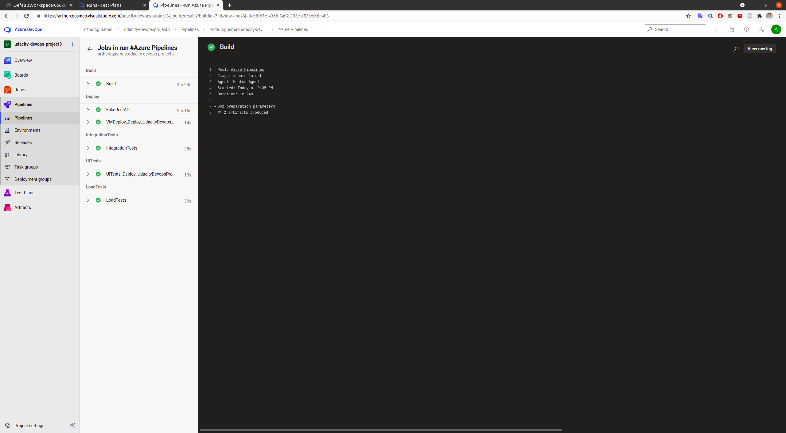
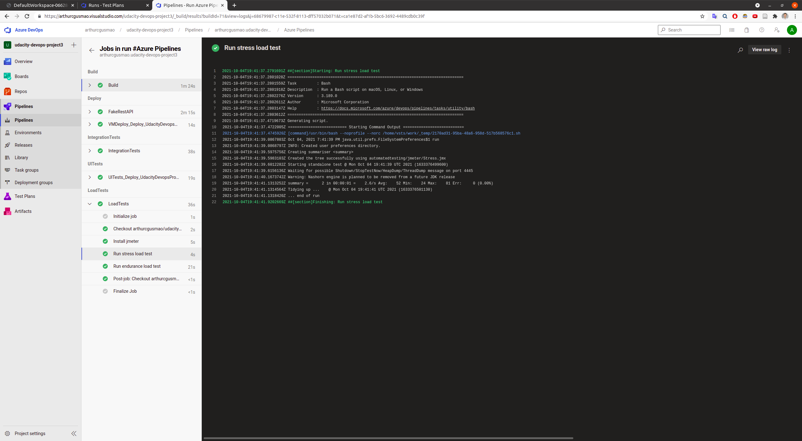

# Project: Ensuring Quality Releases

## Introduction

In this project, we've created a set of disposable test environments using Azure and Azure DevOps, alongside logging to collect information from the application's behavior, via Azure Log Analytics and Azure Monitor. The target application is a mocked REST API, which we've deployed to Azure App Services. The automated testing happens mainly through the CI/CD pipeline in Azure Pipelines. There, three major types of tests are performed:

1. Integration tests
2. Functional UI tests
3. Performance (load) tests

The remainder of this document presents information with greater detail as well as screenshots of the project outcome.

## Environment Creation & Deployment

### Terraform

The source files of the Infrastructure as Code used for this project can be found in the [terraform](./terraform) directory. A screenshot of the output of the Terraform command run in the CI/CD pipeline is presented below.

### Azure Pipelines

The CI/CD pipeline was created in Azure DevOps, and configured via [this YAML file](./azure-pipelines.yaml). A screenshot of the pipeline's build results page can be seen below, as well as a screenshot of the overview of the pipeline with the stages in a diagram representation.

## Automated Testing

### Performance (load) tests

A [load test suite](./automatedtesting/jmeter/) was created with JMeter to test the performance of our application. Both endurance and stress tests were created and performed, of which results can be found in the following places: [endurance report](./reports/endurance/index.html); [stress report](./reports/stress/index.html). Screenshots of the executing of both tests in the CI/CD pipeline are shown below.

### Functional UI tests

The UI tests were automated via the Selenium set of tools, using the Python Selenium package and ChromeDriver. The file that contains the script for our tests can be found [here](./automatedtesting/selenium/login.py). A screenshot of the execution of the tests in the pipeline is presented below.

### Integration tests

Our integration tests consisted of performing both data validation and regression (checking for successful responses) across the four CRUD (Create, Read, Update, Delete) operations of our API endpoint. A summary of the tests results can be seen in the first screenshot below, followed by a more detailed output provided by the CLI command and the publishing of the test results in the pipeline.

## Monitoring and Observability

### Azure Monitor

In addition to automated testing and infrastructure creation, we also configured monitoring in Azure. An alert was created in the case of abnormal high data being downloaded from our application, in which case an email was sent to the responsible people in the organization. Please find below, respectively, screenshots of: the email delivered when the alert was triggered, the graphs of the application of when the alert was triggered, and the alert rule.

### Azure Log Analytics

The output of the UI tests are collected by Azure Log Analytics. Below there is a screenshot of a query with its results set, including timestamps, of the output of the execution of the Selenium automated tests.

